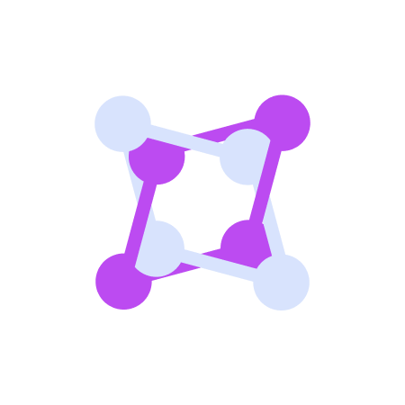

<p align="center">

</p>
<p align="center"> <h1>ahql</h1></p>


Akka Http Query Library, minimal GraphQL client and server exposing as a set of akka-http utilities.

## Setup

**Latest Version**: `0.1.0`

```sbt
"io.github.d-exclaimation" % "ahql" % latestVersion
```

## Usage/Examples

- [Getting Started](https://overlayer.netlify.app/docs/intro)

### Feedback

If you have any feedback, feel free to reach out through the issues tab or through my
Twitter [@d_exclaimation](https://twitter.com/d_exclaimation).
